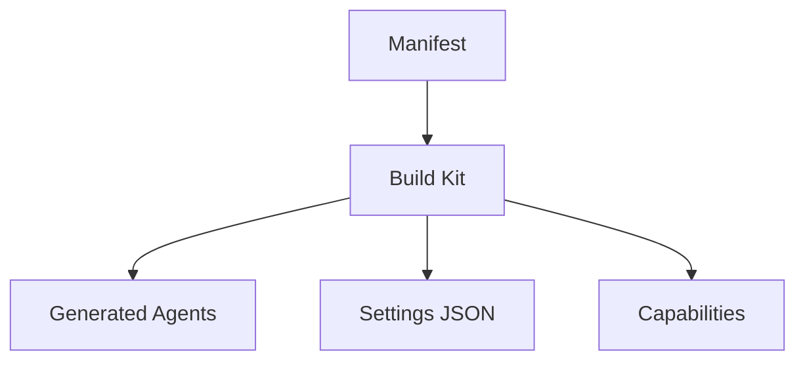
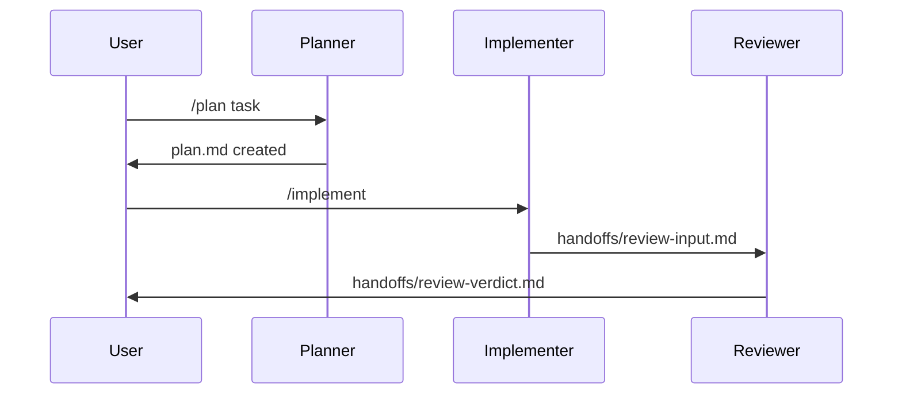
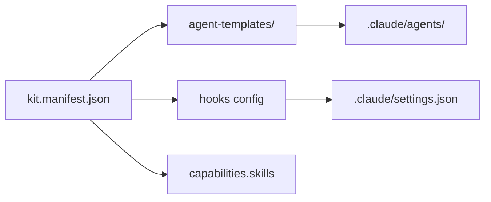
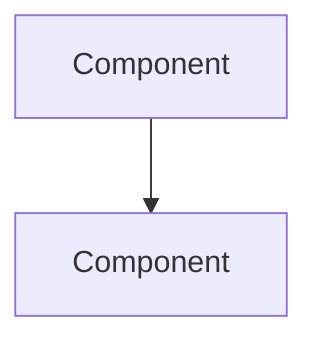

# Intuitive Explanation

## Triggers

Scope notes: Markdown-embeddable, no external rendering dependencies. Use when documenting system shape, agent interactions, or dependency chains.

- Architecture documentation or knowledge capture covering system shape
- Plan reviews with complex dependency chains or multi-phase workflows
- Component relationship mapping for onboarding or design docs
- Agent-to-agent or hook-to-hook interaction visualization

## Diagram Types

### Component Relationships and System Flows



### Agent-to-Agent or Tool-to-Tool Interactions



### Dependency Trees and File Ownership Maps



## Usage Rules

- Use Mermaid syntax only — no external rendering services or image generation
- Every diagram must render in GitHub Markdown and standard Markdown editors
- Label all nodes with human-readable names (not IDs or abbreviations)
- Add a `%%` comment line at the top of each diagram block stating its purpose
- Restrict to `flowchart TD`, `sequenceDiagram`, and `graph LR` — these have the broadest renderer support
- Keep diagrams under 20 nodes to maintain readability

## Embedding Pattern

For long plan or knowledge files, wrap diagrams in a collapsible section:

```markdown
<details>
<summary>Architecture diagram</summary>



</details>
```

## When To Use

- **Architecture docs** — show how subsystems connect
- **Plan reviews** — visualize multi-phase dependency chains
- **Knowledge captures** — document system shape for future reference
- **Handoff documents** — help the next agent understand the flow
- **Debug reports** — trace failure paths through components

## Gotchas

- Not all Mermaid features work in all renderers — stick to the three supported diagram types
- GitHub renders Mermaid in code blocks but some editors need plugins
- Sequence diagrams with more than 8 participants become hard to read — split into multiple diagrams
- Do not use Mermaid for data that changes frequently — it's for structural documentation, not live dashboards
