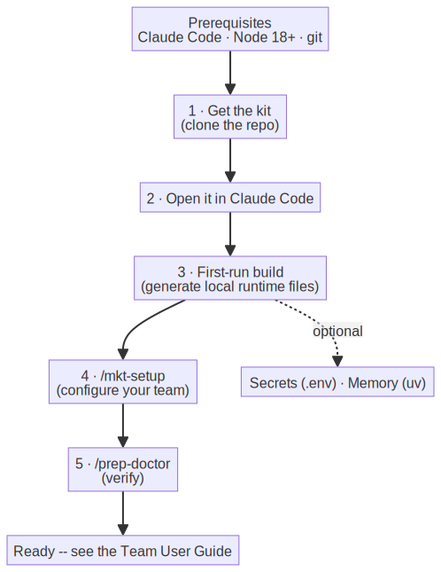

# PrepEdu Marketing Kit — Installation & Setup

How to get the kit running on a machine, up to the point where you can run `/mkt-setup` and start
working. For day-to-day use after this, see the **[Team User Guide](./marketing-user-guide.md)**.

Two audiences:
- **A — Marketers / teammates** (most people): one copy-paste command installs everything and ends
  inside Claude Code with the setup questions — no git, no terminal skills needed.
- **B — Developers & maintainers** (editing the kit itself): clone the repo with git and build with
  `./install.sh`.

---

## What you need (prerequisites)

| Need | Why | Check / get it |
|---|---|---|
| **Claude Code** | The host you run the kit in (desktop app, CLI, or IDE extension) | https://claude.com/claude-code |
| **Node.js 18+** | The kit's scripts run on Node (zero extra dependencies) | `node --version` |
| **git** | Get and update the kit | `git --version` |
| *uv* (optional) | Only for cross-session **memory** (`sage-memory`) | https://docs.astral.sh/uv/ |
| *Provider API keys* (optional) | Only for **image/video generation** | see `.env.example` (billing required) |

The kit needs **no `npm install`** — there's no `package.json`; the scripts use the Node standard
library only.

---

## One line from a blank machine (easiest)

On a fresh Mac or Linux box with nothing installed, this single command installs Claude Code, Node.js,
**and** the kit — no prerequisites, no admin password (Node goes in `~/.local`; the kit is fetched as a
tarball, so even `git` isn't required):

```bash
curl -fsSL https://raw.githubusercontent.com/prepforeverything/prep-marketing/main/bootstrap.sh | bash
```

When the install finishes it **opens Claude Code inside the kit for you**: sign in when asked (paid
Pro/Max plan), trust the folder, and answer the setup interview's questions — the command queues
`/mkt-setup` automatically on a fresh install, and just opens the kit when your team's config already
exists. There is nothing else to run.

Useful to know:
- The kit lands in `~/prep-marketing` (override with `PREP_DIR=/path`).
- **Re-running the same line updates the kit in place** — your `context/` (brand data, claims,
  config), built pages, and `.env` are always kept.
- Because the kit arrives as a tarball, there's **no git checkout on the machine** — teammates never
  see branches, diffs, or merge conflicts.
- `PREP_NO_LAUNCH=1` skips the hand-off into Claude Code (for CI or scripted installs).

> **Windows:** this one-liner is macOS/Linux only. Install Claude Code (`winget install
> Anthropic.ClaudeCode`) and Node.js ([nodejs.org](https://nodejs.org)), then use **The git path**
> below inside **Git Bash** (from [Git for Windows](https://git-scm.com/download/win)).

## The git path (developers & maintainers)

Use this only if you'll **edit the kit itself** (or you just prefer git). Day-to-day marketing
machines are better served by the one-liner above: it has no git working tree to keep clean and
updates by re-running one command.

```bash
git clone https://github.com/prepforeverything/prep-marketing.git
cd prep-marketing
./install.sh
```

`./install.sh` is safe to re-run any time. It checks your tools, builds the kit's local files,
scaffolds `.env`, and verifies the kit — then prints **"You're ready."** After that:

1. **Open the folder in Claude Code** (desktop app, CLI, or IDE extension).
2. Type **`/mkt-setup`** — a plain-language interview that captures your company, language/market, and
   governance, and scaffolds your `context/`.
3. Type **`/mkt`** — the front door for any marketing task.

That's the whole install. The sections below explain what `install.sh` does for you, and how to do
each step by hand if you ever need to.

<!-- image rendered from assets/install-flow.mmd (source of truth) — re-render: see assets/README.md -->


---

## What `install.sh` does for you

Each of these is a step you could run by hand — `install.sh` just runs them in order and reports
clearly. (Opening the project in Claude Code also triggers the **first-run build** automatically: it
reads the committed pack selection and builds the marketing kit, so even without the script you get
working `/mkt` commands. `install.sh` is still the recommended path — it also checks prerequisites,
scaffolds `.env`, and runs the health check.)

| Step | By hand | Notes |
|---|---|---|
| **1. First-run build** | `node .prepkit/scripts/build-pack.mjs --packs marketing,customer-prepedu` | Generates local runtime files (kit manifests, the capability index) that aren't committed. Deterministic and safe to re-run; never touches your `context/` or `.env`. |
| **2. Secrets scaffold** | `cp .env.example .env` | Only created if `.env` doesn't already exist — your keys are never overwritten. `.env` is git-ignored. Optional (see below). |
| **3. Verify** | `node .prepkit/scripts/doctor-checks.mjs` | Validates the kit's structure and runtime references. Clean output means you're ready. (Inside Claude Code: `/prep-doctor`.) |

The slash commands (`/mkt`, `/mkt-campaign`, …) **and** your team's `context/` (brand voice,
positioning, claims) are committed, so they're present right after cloning — the build only generates
the *local* runtime files around them.

**Brand-new project (advanced):** to stand up a fresh kit from scratch (not the PrepEdu team repo), use
the PrepKit installer and select the marketing pack — see [`getting-started.md`](./getting-started.md)
for the `curl … install.sh` flow and the standalone `prepkit` binary.

---

## Configure your team (`/mkt-setup`)

Run **`/mkt-setup`** in Claude Code. It writes `context/marketing.config.json` and scaffolds your
`context/`:
- **Joining the existing PrepEdu kit** → it detects your already-populated `context/` and just confirms
  the settings (company, language/market, governance posture).
- **A new company** → it runs the full interview and scaffolds fresh context files.

When it confirms your company, locale, market, and governance in one line, you're configured.

---

## Secrets (only if you need them)

`install.sh` already created `.env` from the template. You only need to fill it in for **image/video
generation** (`/mkt-generate-asset`) or **connecting tools** (`/mkt-connect` — analytics/ads/messaging).
Skip it otherwise.

Fill in **only** the keys for features you actually use; `.env` is git-ignored — never commit it.
`.mcp.json` and the connectors read these values through `${ENV}` references, so secrets stay out of
chat and out of the repo. Each key is documented in `.env.example`.

---

## Memory (optional)

The kit can remember learnings across sessions via `sage-memory` (configured in `.mcp.json`), which
needs **uv**:
- Install uv → https://docs.astral.sh/uv/ . `sage-memory` then connects automatically.
- Without it, the kit falls back to your `context/` files — **everything still works**, it just doesn't
  carry learnings between sessions.

`install.sh` tells you which of these applies on your machine.

**→ Next: the [Team User Guide](./marketing-user-guide.md)** — daily tasks, big campaigns, and
automation.

---

## For maintainers (editing the kit itself)

The kit is **manifest-first**: edit sources under `.prepkit/`, then rebuild + validate. Never hand-edit
the generated files in `.claude/`.

```bash
node .prepkit/scripts/build-pack.mjs --packs marketing,customer-prepedu
node .prepkit/scripts/validate-kit.mjs
```

After changing the claims gate or `context/claims.json` shape, run the deterministic regression suite:

```bash
bash .prepkit/packs/marketing/gates/tests/run.sh   # must exit 0
```

Other hosts: the kit can also target Codex (via a generated `AGENTS.md`, `.agents/skills/`, and
`.codex/agents/`); see [`getting-started.md`](./getting-started.md).

---

## Troubleshooting

| Symptom | Fix |
|---|---|
| One-liner finished but no setup questions appeared | In the Claude Code window it opened, type `/mkt-setup` and press Enter. (If it didn't open Claude Code at all, run `cd ~/prep-marketing && claude` yourself.) |
| `./install.sh: permission denied` | Run `chmod +x install.sh` once, or use `bash install.sh`. |
| `node: command not found` | Install Node.js 18+ (`node --version` to confirm), then re-run `./install.sh`. |
| Slash commands don't appear | Reopen the project folder in Claude Code; if still missing, re-run `./install.sh`. |
| `/mkt-setup` keeps re-asking | Your `context/` is empty/`draft` — finish the interview, or pull the team's committed `context/`. |
| Memory features do nothing | Install `uv`; confirm `sage-memory` is in `.mcp.json`. (Optional — the kit works without it.) |
| Image/video generation errors | Set the relevant key in `.env` (e.g. `GEMINI_API_KEY`); hosted generation needs billing. |
| `/prep-doctor` flags an issue | Follow its hints; for a fresh clone, re-running `./install.sh` resolves most. |

---

*Installation gets you to a working kit; the **[Team User Guide](./marketing-user-guide.md)** takes it
from there.*
