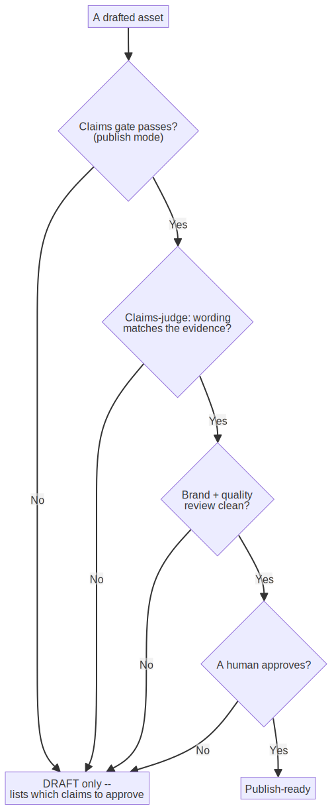
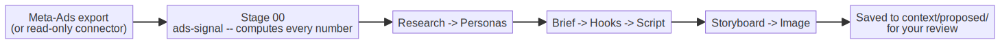

# PrepEdu Marketing Kit — Team User Guide

A plain-language guide for the PrepEdu marketing team. **No technical knowledge needed.** If you can
type what you want in a chat box, you can use this kit.

> New here? Read sections 1–3, then keep section 9 (the cheat-sheet) open while you work.

---

## 1. What this is, and why we have it

This kit turns Claude into **your marketing team inside your editor**. You ask for something in plain
words — "write a reminder email for IELTS students before the exam" — and it interviews you, looks up
your approved brand and product facts, drafts the work on-brand, checks every claim, and asks for your
approval before anything is called "ready to publish".

It exists to solve three everyday problems:

- **Speed without losing the brand.** Drafts come back in your brand voice, grounded in *your* real
  positioning and products — not generic AI filler.
- **Safety on claims.** Education marketing makes promises (prices, score guarantees, "#1", student
  counts). The kit will not let an unverified number be marked "publish-ready" — it stays a clearly
  labelled DRAFT until a real person approves the claim.
- **One front door for everyone.** You never need to remember which specialist or tool to use. You
  start in one place and it routes you.

Three promises hold everywhere in the kit:

1. **Your `context/` files are the source of truth.** Agents read them before writing anything.
2. **Claims are governed.** Nothing is "publish-ready" unless every number/price/guarantee maps to an
   **approved** claim.
3. **You approve before publishing.** The kit pauses at checkpoints; it never sends, posts, or spends
   on its own.

---

## 2. The mental model (how one request flows)

<!-- image rendered from assets/request-flow.mmd (source of truth) — re-render: see assets/README.md -->

You only ever do two things: **describe what you want**, and **approve (or ask for changes)** at the
🔒 checkpoints. The kit does the routing, drafting, and checking in between.

---

## 3. First-time setup (once)

1. **`/mkt-setup`** — a guided interview. It captures your company, language/market, and governance
   preference, scaffolds your `context/` files, and offers to connect analytics. Re-run it any time to
   update settings.
2. **Tell the kit your role** *(optional)* — say e.g. "set me up as the growth lead" and it tunes
   defaults to match. Roles: head of marketing, growth lead, content lead, GTM lead, LTV/retention
   lead, ops lead.
3. **`/mkt-connect`** *(optional)* — connect a tool (analytics, ads, messaging). It starts **read-only**
   and keeps secrets out of the chat. Publishing/sending/spending stays behind approval.

You're ready when `/mkt-setup` confirms your company, locale, market, and governance in one line.

---

## 4. Daily tasks — start at the front door

For *anything*, type **`/mkt`** and say what you want in plain words. It shows a simple menu — *do a
task* or *plan/build something* — confirms the route in one sentence, then does the work and pauses for
your approval.

Prefer a **`/mkt-*`** command: each one runs the right skills **and** the brand + claims review under
the hood, so nothing skips the safety gate.

| I want to… | Command | What you get |
|---|---|---|
| Just start *anything* | `/mkt` | A guided menu that routes you |
| Run a full campaign | `/mkt-campaign` | The end-to-end "golden path" (see §5) |
| Build a landing page | `/mkt-build-landing-page` | A conversion page, claim-tagged, brand-reviewed |
| Write a blog / SEO article | `/mkt-write-blog` | Intent + outline + draft, claims-checked |
| Make a social post pack | `/mkt-social-pack` | Platform-native posts + a posting cadence |
| Audit SEO / ASO | `/mkt-seo-audit` | Prioritized Issue → Impact → Fix findings |
| Build an email/Zalo sequence | `/mkt-email-sequence` | A segmented lifecycle flow with per-step copy |
| Plan a product/course launch | `/mkt-launch` | Positioning, phased plan, sales-enablement |
| Make a performance report | `/mkt-report` | Metrics by funnel/channel vs target + next actions |
| Generate an image/video | `/mkt-generate-asset` | Brand-aligned visuals with a quality loop |
| Research a market/competitor | `/mkt-research` | **Proposed** context updates (never overwrites) |
| Measure a shipped campaign | `/mkt-measure` | Read-only results vs target + one learning |

**Two habits that keep you safe**

- **DRAFT vs publish-ready.** If a number isn't approved yet, the work comes back as a clearly labelled
  DRAFT with a note on exactly what to approve. That's normal — approve the claim, then it clears.
- **Confirm the route.** The kit restates what it's about to do in one sentence. A quick "yes" keeps it
  on track.

---

## 5. Preparing a big campaign — the golden path

For a real campaign, run **`/mkt-campaign "<your goal>"`** (e.g. `"launch a summer IELTS promo"`). It
walks eight phases and pauses at every 🔒 for your approval. You can stop and resume — work is saved to
files, not chat.

<!-- image rendered from assets/golden-path.mmd (source of truth) — re-render: see assets/README.md -->

- **Phases 1 & 3 (🔒)** — you confirm the request and the brief. The kit only uses **approved** proof
  points here.
- **Phase 5** — two reviewers run automatically: one scores content quality, one checks brand voice and
  that every claim's wording matches its approved evidence. It fixes and re-checks until both pass.
- **Phase 6 (🔒)** — the publish boundary (see §6). Nothing is "publish-ready" until it clears.
- **Phase 8** — `/mkt-measure` closes the loop: it pulls results vs your one success metric and captures
  a learning for next time.

**For something bigger than one asset** — a quarter's growth push, a multi-channel launch, a
cross-pillar initiative — ask the kit to **"plan this with the marketing strategist."** The
`marketing-strategist` agent (your virtual Head of Marketing) breaks the goal into a sequenced,
owner-assigned, approval-gated plan and dispatches the right specialists for each step.

---

## 6. How it keeps you safe (the claims & approval model)

This is the heart of the kit. An asset becomes **publish-ready only if ALL four conditions hold**:

<!-- image rendered from assets/publish-boundary.mmd (source of truth) — re-render: see assets/README.md -->

**Claims, in plain terms.** Any number, price, guarantee, or comparison in customer copy must map to an
**approved** entry in `context/claims.md` (`context/claims.json`). In the working copy each one is
tagged (for example, `CLM-008`). Until a claim is approved (with real evidence), copy that uses it stays
a DRAFT.

**The gate's two modes.**
- **Draft mode** is lenient — unverified claims are allowed while you're still writing.
- **Publish mode** is strict — an unverified or mistagged claim fails, so it can't be called ready.

**Governance posture (important right now).** The kit has a setting, `governance.publishGate`:
- **`warn`** *(your current setting)* — flags unverified claims but still lets you save the file
  (advisory). This is on purpose **while your team verifies output quality**.
- **`deny`** — blocks saving any publish-ready file that still has an unverified claim (fail-closed).
- **`off`** — no checking.

When the team is happy with the output, switch to **`deny`** to fully enforce the promise — it's a
one-line change in `context/marketing.config.json` (`"publishGate": "warn"` → `"deny"`), or just ask
Claude to do it. Everything already supports it.

**Connectors are read-only first.** Analytics/ads/messaging tools you connect start read-only; anything
that sends, posts, or spends stays behind a human-approval step.

---

## 7. Running automation

Beyond one-off tasks, the kit has automated, repeatable pipelines.

**`/mkt-creative-run` — data-driven ad creative.** A multi-stage pipeline that turns real ad-performance
data into fresh creative concepts:

<!-- image rendered from assets/creative-run.mmd (source of truth) — re-render: see assets/README.md -->

What makes it trustworthy: **every figure is computed with code** (`ads-signal.mjs`) — fatigue
scores, significance flags, spend efficiency — and the AI is forbidden to invent numbers; it only
describes the pre-computed table. Everything it produces lands in `context/proposed/` as **proposals**
for a human to review — it never edits your approved `context/`.
*It runs end-to-end up to a "design lock" checkpoint, where you review before any assets are produced.*

**Workflows.** The kit ships repeatable multi-step workflows the strategist can run — golden campaign,
launch, content pipeline, lifecycle/retention, growth loop, conversion optimization, and more. You don't
invoke these directly; ask for the outcome ("plan a launch") and the strategist sequences the workflow.

**Connectors (`/mkt-connect`).** Tools graduate through **read → draft → execute**: they start
read-only, then can prepare drafts, and only *execute* (send/post/spend) behind explicit human approval
with an audit trail. Live-write connectors are phased in as you need them.

**Close the loop with `/mkt-measure`.** After anything ships, it pulls results (read-only) against the
target, flags data gaps honestly, and proposes the next experiment.

---

## 8. Your source of truth — the `context/` folder

Everything the kit writes is grounded in these plain-text files. Edit them like documents; they're
yours.

| File | What it holds |
|---|---|
| `marketing.config.json` | Company, language/market, governance posture |
| `brand-voice.md` | How we sound (tone, do/don't, per-segment voice) |
| `positioning.md` | Our positioning and differentiation |
| `products.md` | What we sell |
| `audience-personas.md` | Who we're talking to |
| `competitors.md` | Competitors (each comparison needs a dated source) |
| `claims.md` / `claims.json` | The approved-claims registry (the safety backbone) |
| `markets/<market>.md` | Per-market language, channels, legal notes |
| `exam-calendar.md` | Exam-intent windows — a top test-prep demand driver |

**`/mkt-research` proposes, never overwrites.** Research writes suggestions to `context/proposed/` for a
human to merge — your approved context is never changed automatically.

---

## 9. Quick reference

**Start anything:** `/mkt` · **Set up:** `/mkt-setup` · **Connect a tool:** `/mkt-connect`

**Make things:** `/mkt-campaign` · `/mkt-build-landing-page` · `/mkt-write-blog` · `/mkt-social-pack` ·
`/mkt-email-sequence` · `/mkt-launch` · `/mkt-generate-asset`
**Analyze:** `/mkt-seo-audit` · `/mkt-report` · `/mkt-measure` · `/mkt-research`
**Automation:** `/mkt-creative-run`

**Plain-language glossary**

- **Claim** — any number, price, guarantee, or comparison. Must be approved before it's publish-ready.
- **Claim tag** — a marker linking a sentence to an approved claim in the registry.
- **DRAFT vs publish-ready** — DRAFT is fine and expected; publish-ready means it cleared all four
  safety checks.
- **🔒 checkpoint** — a point where the kit pauses for your approval.
- **Persona** — a role preset you can ask for in plain words ("set me up as the growth lead") that tunes defaults to your job.
- **Context** — your `context/` files; the facts the kit is allowed to use.

---

## 10. When something feels off

- **"It's asking about things I already told it"** → your `context/` may be empty or `draft`. Run
  `/mkt-setup`.
- **"It won't call my copy publish-ready"** → a claim is still unverified. It will name the claim id;
  approve it in `context/claims.md` (with evidence), then re-run.
- **"Is the kit healthy?"** → ask at the `/mkt` prompt; maintainers can run `/prep-doctor`.
- **Stuck?** → just describe the problem in plain words at the `/mkt` prompt. It's built to guide you.

---

*This is the canonical team guide. For the build history and safety invariants, see
[`ROADMAP.md`](../../../ROADMAP.md); for the quick orientation, see [`README.md`](../../../README.md).*
