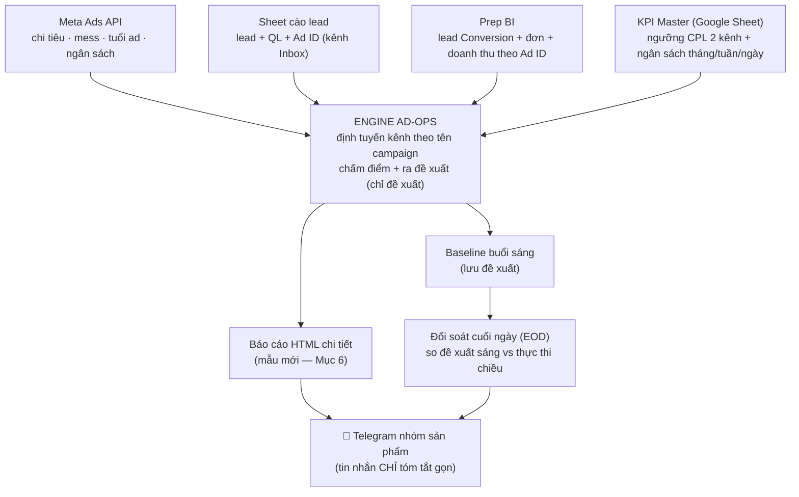

# Tổng quan & Quy hoạch hệ thống Tối ưu Quảng cáo (Ad-ops) — Prep Digital

> Tài liệu "một cửa vào" cho quản lý: đọc file này là nắm được **toàn bộ logic, hiện trạng theo từng sản phẩm × kênh, và lộ trình 3 phase** của phần tối ưu ads. Cần đào sâu phần nào thì bấm link ở [Mục 9](#9-tài-liệu-chi-tiết-đào-sâu).
>
> Cập nhật: 2026-08-04 · Phạm vi: 6 sản phẩm (TOEIC, VSTEP, IELTS VN, IELTS Thái, HSK, PTE) × 3 kênh (Inbox, Conversion, Branding).

---

## 1. Mục tiêu & nguyên tắc

Mỗi ngày, hệ thống **tự động đọc dữ liệu quảng cáo**, chấm hiệu quả **từng chiến dịch → nhóm quảng cáo → từng Ad ID**, rồi **đề xuất hành động** (scale / giữ / giảm / tắt) và gửi báo cáo vào nhóm Telegram của từng sản phẩm để nhân sự thao tác.

**Nguyên tắc an toàn cốt lõi:**
- ✅ Hệ thống **CHỈ ĐỀ XUẤT**. **KHÔNG** tự tiêu tiền, **KHÔNG** tự bật/tắt/chỉnh ngân sách trên Meta. Người phụ trách vẫn là người quyết định & thao tác cuối cùng.
- ✅ Chạy **headless trên GitHub Actions** (không cần máy ai bật), tự động 2 lần/ngày + 1 lần đối soát cuối ngày.
- ✅ Mọi ngưỡng KPI, ngân sách, quy tắc đều **đọc "live"** từ nguồn dữ liệu mỗi lần chạy — sửa trên sheet là hệ thống cập nhật ngay, không cần đụng code.
- ✅ Mọi thay đổi logic tối ưu đi qua quy trình: **kiểm chứng bằng dữ liệu → trình duyệt → mới triển khai.**

---

## 2. Quy hoạch kênh — mỗi sản phẩm có tối đa 3 nhánh

Trước đây hệ thống chỉ chấm nhánh **Inbox**. Quy hoạch mới tách rõ 3 kênh, **định tuyến tự động theo TÊN campaign**:

| Kênh | Nhận diện (tên campaign chứa) | Lead lấy từ | Đơn/Doanh thu (ME/RE) lấy từ | Cách chấm |
|---|---|---|---|---|
| **Inbox (Messenger)** | "inbox" | Sheet cào lead (khớp Ad ID) | **Prep BI** (first_paid, theo Ad ID) | 2 ma trận (Mục 4) |
| **Conversion (LDP)** | "conversion" | **Prep BI** (theo Ad ID) | **Prep BI** (first_paid, theo Ad ID) | 2 ma trận, KPI CPL riêng của kênh |
| **Branding** | còn lại | — | — | Chỉ theo dõi chi tiêu, **không áp luật CPL/ME-RE** |

**3 quyết định chuẩn hoá (chốt 04/08/2026, đã kiểm chứng trên HSK):**
1. **Đơn & doanh thu thống nhất lấy từ Prep BI** (mô hình first_paid) cho cả Inbox lẫn Conversion — không đọc cột doanh thu tay trong sheet cào (tránh 2 nguồn lệch nhau).
2. **Vòng đời ad giữ theo engine** (Phiên 1 / Phiên 2 / Mốc 2+ — Mục 4), thống nhất mọi sản phẩm.
3. **KPI CPL đọc riêng từng kênh** từ KPI Master (ví dụ HSK: Inbox 315.000đ · Conversion 200.000đ).

---

## 3. Luồng chạy hằng ngày

**Lịch chạy (giờ VN):** ~10h sáng (chính) và ~14h chiều (rà lại), một số sản phẩm có thêm mốc ~17h + **đối soát cuối ngày (EOD)**. Cơ chế chống gửi trùng: cờ "đã gửi" lưu vào Git.

---

## 4. Logic quyết định — 2 ma trận

Hệ thống chấm CPL (giá mỗi lead) thành **4 vùng** theo ngưỡng KPI của từng sản phẩm × kênh: **Tốt** (< KPI) · **TB** · **Yếu** · **Rất tệ** (≥ ngưỡng rất tệ).

### 4.1 Ma trận CHỈ theo CPL — nền, mọi ad luôn có đánh giá

Trục: **Tuổi ad** (số ngày từ lúc bật/bật lại) × **Vùng CPL**.

| Tuổi ↓ \ CPL → | **Tốt** | **TB** | **Yếu** | **Rất tệ** |
|---|---|---|---|---|
| **Phiên 1 (≤3 ngày)** — cổng, chấm cửa sổ 3 ngày | GIỮ | GIỮ | 🔴 TẮT cổng ⁽¹⁾ | 🔴 TẮT cổng ⁽¹⁾ |
| **Phiên 2 (4–6 ngày)** — kiểm chứng, chấm 3 ngày | GIỮ | GIỮ | 🟠 GIẢM 20% | 🔴 TẮT |
| **Mốc 2+ (≥7 ngày)** — scale/tắt, chấm 7 ngày | 🟢 SCALE +20% ⁽²⁾ | GIỮ | 🟠 GIẢM 20% | 🔴 TẮT ⁽³⁾ |

- ⁽¹⁾ **Guard mẫu mỏng:** ad mới bật lại mà lead < 3 (chưa đủ mẫu) → **KHÔNG tắt**, chỉ "Theo dõi (chưa đủ mẫu)" — tránh tắt oan.
- ⁽²⁾ Scale khi đủ lead; Mốc 2+ còn xét nền 7 ngày (3d & 7d cùng tốt mới scale mạnh).
- ⁽³⁾ Rất tệ nhưng lũy kế tháng (MTD) tốt → CẢNH BÁO (review) thay vì tắt thẳng.
- **Ngoại lệ chung:** 0 lead + chi cao → 🟠 XEM XÉT TẮT / mở Pancake soi inbox; CR đơn cao dù CPL > KPI → GIỮ.

### 4.2 Ma trận KẾT HỢP CPL × ME/RE — khi ad đủ cổng ME/RE

**ME/RE** = chi 7 ngày ÷ doanh thu 7 ngày = thước đo **lời/lỗ thật**. Khi ad đủ điều kiện, ME/RE **thắng** CPL (vì đo trực tiếp hiệu quả tiền).

| ME/RE ↓ \ CPL → | **Tốt** | **TB** | **Yếu** | **Rất tệ** |
|---|---|---|---|---|
| **Tốt (<50%)** | 🟢 SCALE MẠNH +50% | 🟢 SCALE +20% | 🟠 GIẢM + tối ưu lại | ⚠️ Cân nhắc tắt ngắn hạn, test lại |
| **TB (50–70%)** | GIỮ | GIỮ | 🟠 GIẢM 20% | ⚠️ GIẢM 20%, theo dõi sát / cân nhắc tắt |
| **Yếu (70–100%)** | 🟠 GIẢM 20%, xem lại tệp | 🔴 TẮT | 🔴 TẮT | 🔴 TẮT |
| **Rất tệ (≥100%)** | 🔴 TẮT | 🔴 TẮT | 🔴 TẮT | 🔴 TẮT bắt buộc |

**Luật đi kèm:**
- **ME/RE ≥ 100% (lỗ: chi > doanh thu):** auto TẮT bất kể CPL.
- **Cổng vào ma trận này:** chỉ chấm ME/RE khi ad **có doanh thu VÀ** (tuổi ≥ 7 ngày **HOẶC** đủ đơn: VSTEP/HSK ≥3, Thái ≥2). Chưa đủ cổng → **rơi về Ma trận 4.1 (CPL thuần)**.
- **Ngoại lệ xin duyệt:** ad có CPL rất tệ (tab CPL đòi tắt) nhưng ME/RE còn giữ → gắn cờ "cần xin duyệt ngoại lệ", **gom danh sách Ad ID ở cuối checklist**, và **loại khỏi lệnh tắt tự động cuối ngày** (để người quyết).

**Quan hệ 2 ma trận:** Ma trận CPL là nền (mọi ad luôn có đánh giá). Khi ad đủ cổng ME/RE thì ma trận kết hợp thắng. Sản phẩm chưa có doanh thu per-ad thì chỉ chạy ma trận CPL.

---

## 5. Hiện trạng theo sản phẩm × kênh (04/08/2026)

| Sản phẩm | Inbox | Conversion | Branding | ME/RE | Ghi chú |
|---|---|---|---|---|---|
| **TOEIC** | ✅ Đang chạy (2 TK) | ✅ **Đã chấm trong báo cáo mới** (TK "TOEIC 2" — 7 campaign, trước đây chưa ai chấm) | ✅ Mục riêng trong báo cáo | Ma trận 4×4 ✅ | 10:07 · 14:07 · EOD |
| **VSTEP** | ✅ Đang chạy (1 TK) | ✅ Sẵn sàng — hiện **0 campaign chạy** dù KH cấp 10,9tr/tuần (pacing phơi khoảng trống) | ✅ Mục riêng trong báo cáo | Ma trận 4×4 ✅ | 10:10 · 17:10 · EOD |
| **IELTS VN** | ✅ Đang chạy (3 TK) | — (chưa quy hoạch) | — | Ma trận 4×4 ✅ (bật 08/2026) | 10:07 · 14:07 |
| **IELTS Thái** | ✅ Đang chạy (2 TK, gộp Nhóm QC) | ✅ Đang chạy (engine riêng theo campaign/UTM) | — | Ma trận 4×4 ✅ + cổng độ tin | THB→VND ×850 |
| **HSK** | ✅ **Onboard xong + báo cáo mẫu mới** (3 TK) — PR #134 | ✅ **Đã chạy trong báo cáo mẫu mới** (lead theo BI) | ✅ Có mục riêng trong báo cáo | Ma trận 4×4 ✅ | Chờ merge + nhóm Telegram |
| **PTE** | ⏸️ Tạm dừng (dừng ads từ T8) | — | — | ME/RE band | 2 workflow đã disable |

Ghi chú: mỗi sản phẩm 1 nhóm Telegram riêng. Engine dùng **chung một bộ code**; khác biệt nằm ở file cấu hình từng sản phẩm.

---

## 6. Báo cáo thế hệ mới (mẫu chuẩn từ bản NV build — pilot HSK)

Báo cáo HTML mới thay dần bản 3-tab cũ, gồm 9 phần: **Tổng quan 2 kênh** (chi/lead/CPL/QL/đơn/doanh thu/ME-RE) → **Pacing ngân sách** tháng→tuần→ngày so KPI Master (cờ 🟠 vượt >110% · 🟡 hụt <90% · 🟢 đúng ±10%) → **Việc cần làm** (thẻ từng ad, tìm kiếm + lọc) → **Bảng phân tích sâu** (20 cột Inbox / 18 cột Conversion) → **Việc theo ME/RE** chia 5 nhóm hành động + danh sách ngoại lệ xin duyệt → **Branding** → **Cờ chất lượng dữ liệu** → **Phương pháp** → **Nguồn dữ liệu**.

- Tin Telegram **chỉ tóm tắt ~6 dòng** (2 dòng kênh + pacing + đếm việc) — chi tiết nằm hết trong file HTML.
- Báo cáo tự khai **cờ chất lượng dữ liệu** mỗi ngày (dòng cào thiếu Ad ID, tuổi ad xấp xỉ, doanh thu "đuôi" của ad đã tắt…) để người đọc biết tin số nào đến đâu.
- Đã chạy thật với HSK ngày 04/08: 41 đơn vị Inbox / 26 Conversion, số pacing khớp KPI Master từng đồng.

---

## 7. Lộ trình 3 phase (de-risk)

### Phase 1 — HSK nhánh Inbox + pilot báo cáo mẫu mới ✅ **ĐÃ XONG (chờ merge)**
- Onboard HSK như các SP khác: 3 TK Meta (HSK-01/02/03), File cào, KPI line HSK, BI product 5 — **verify bằng dữ liệu thật**.
- Dựng báo cáo theo template NV, người phụ trách đã duyệt bản xem thử 04/08. Gộp trong **PR #134**.
- Còn 2 việc vận hành để chạy hằng ngày: tạo nhóm Telegram HSK (secret `TELEGRAM_HSK_CHAT_ID`) + thêm `hsk` vào lịch chạy sáng.

### Phase 2 — Conversion-theo-BI cho TOEIC / VSTEP ✅ **ĐÃ TRIỂN KHAI (04/08, cùng PR #134)**
- Định tuyến theo tên campaign + lead/đơn/doanh thu kênh Conversion từ Prep BI (first_paid, cửa sổ 7 ngày), KPI CPL kênh Conversion đọc từ KPI Master; đã config-hoá phần đọc sheet cào từng SP để engine dùng chung.
- **Giá trị lộ ra ngay khi bật:** (1) TOEIC — toàn bộ 7 campaign Conversion chạy ở TK "TOEIC 2" chưa từng được chấm (thiếu trong cấu hình cũ); ngày đầu chấm: CPL 437k vs KPI 275k, ME/RE ~2.191% → đề xuất 4 TẮT + 3 ngoại lệ xin duyệt. (2) VSTEP — không có campaign Conversion nào đang chạy dù kế hoạch cấp 10,9tr/tuần → mục pacing phơi rõ để quyết bơm hay cắt.
- IELTS VN hiện không chạy Conversion → giữ nguyên nhánh Inbox.

### Phase 3 — Chuẩn hoá tài liệu + gửi anh Ninh ▶️ **ĐANG GỬI**
- Tài liệu này đã cập nhật theo kết quả Phase 1–2; PR giới thiệu để góp ý inline từng đoạn.
- Việc còn lại sau merge PR #134: nhóm Telegram HSK, thêm `hsk` vào lịch chạy; theo dõi 3 SP chạy format mới vài ngày đầu.

---

## 8. KPI & Vận hành

- **Ngưỡng giá CPL (theo kênh):** đọc từ **1 file KPI Master chung**. Mỗi tháng team nhân bản 1 tab "KPI Tháng N"; **engine tự dò tab theo tháng** — không cần sửa cấu hình. Có kiểm tra chống đọc nhầm tháng.
- **Ngân sách tháng/tuần/ngày** cũng đọc từ file này → báo cáo mới có mục pacing "cần chi bao nhiêu/ngày để bám KPI".
- **Đối soát cuối ngày (EOD):** sáng lưu đề xuất (baseline), chiều so với thực thi để theo dõi mức độ tuân thủ (không chấm đúng/sai, chỉ để nhìn).
- **Cảnh báo an toàn:** thiếu dữ liệu (không đọc được KPI / lead / Meta lỗi) → hiện cảnh báo rõ, **không âm thầm dùng số cũ**.

---

## 9. Tài liệu chi tiết (đào sâu)

| Tài liệu | Nội dung |
|---|---|
| [`quy-tac-toi-uu-quang-cao.md`](./quy-tac-toi-uu-quang-cao.md) | Bộ quy tắc tối ưu FB ad-ops đầy đủ (chuẩn chung các sản phẩm) |
| [`quy-tac-attribution-prep-bi.md`](./quy-tac-attribution-prep-bi.md) | 4 mô hình attribution của Prep BI (first_paid mặc định) |
| [`daily-workflow.md`](./daily-workflow.md) | Chi tiết luồng chạy hằng ngày |
| [`README-engine.md`](./README-engine.md) | Kiến trúc engine, cách chạy, cấu hình |
| [`theo-doi-tuan-thu.md`](./theo-doi-tuan-thu.md) | Cơ chế đối soát tuân thủ cuối ngày |
| [`lessons-learned.md`](./lessons-learned.md) | Lỗi đã gặp + cách xử lý (kinh nghiệm vận hành) |

**Kiến trúc kỹ thuật (tóm tắt):** engine Python tại `automation/engine/` — `run_daily.py` điều phối; `adops.py` (Inbox chuẩn), `adops_inbox.py` (Thái, gộp Nhóm QC), `adops_conv.py` (Thái Conversion theo UTM), `adops_nv.py` + `adops_nv_render.py` (**báo cáo mẫu mới, pilot HSK**); `adops_rules.py` chứa toàn bộ luật thuần (2 ma trận) có test riêng; `build_meta.py` (Meta), `prep_bi.py` (BI). Cấu hình: `automation/products/<sp>/config.json`. Lịch: GitHub Actions cron.

---

## 10. Góp ý

Anh/chị góp ý trực tiếp trên Pull Request giới thiệu tài liệu này (comment inline từng đoạn), hoặc mở Issue trên GitHub. Mọi thay đổi logic tối ưu đều đi qua quy trình: **kiểm chứng bằng dữ liệu → trình duyệt → mới triển khai.**
